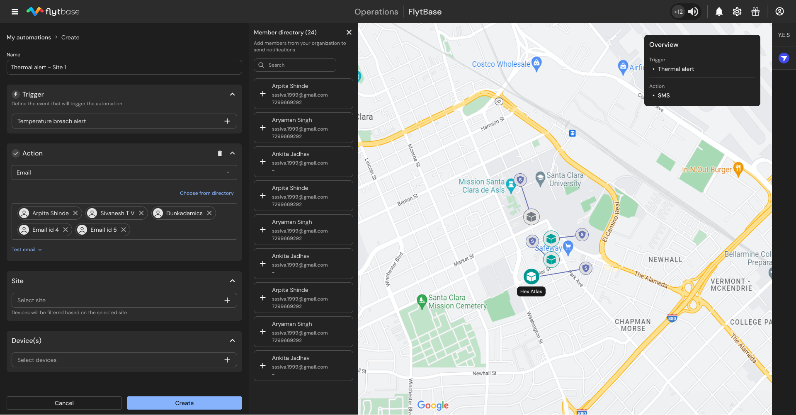

# Introducing Thermal Alert-Based Flows

FlytBase is excited to introduce **Thermal Alert-Based Flows**, an intelligent automation feature that enables users to trigger predefined actions, such as email alerts, when temperature thresholds are breached. This ensures faster response times and improved situational awareness for security, inspection, and industrial monitoring application.

#### Key Features:

* **Site & Device-Based Customization:** Configure alerts based on specific sites and devices, allowing for precise monitoring and tailored responses.
* **Automated Email Notifications:** Instantly send email alerts when temperature anomalies are detected, ensuring timely intervention.

<figure><figcaption>
Using Thermal Alert as a Flow trigger
</figcaption></figure>

For more information, please refer to our documentation.
