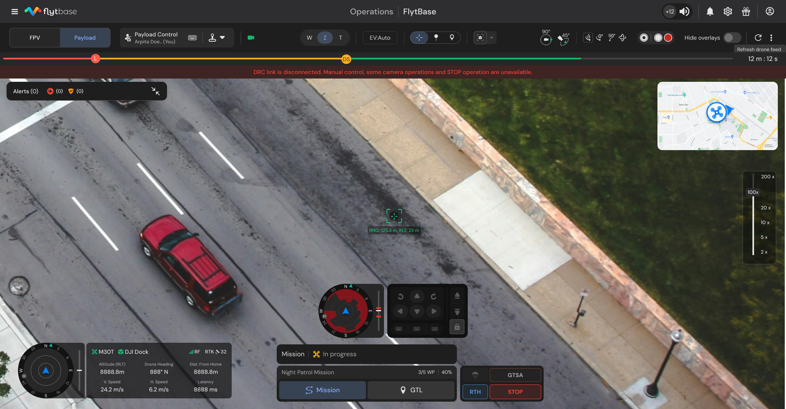

# Introducing DRC Visibility: Enhanced Awareness for Reliable Manual Control

## Introduction

In mission-critical drone operations—especially for security, inspections, and remote monitoring—reliable manual control plays a crucial role. FlytBase now introduces **DRC Visibility**, a new capability designed to instantly alert operators when the Drone Remote Control (DRC) link is lost, ensuring full transparency and control awareness during live operations. DRC refers to backend services on FlytBase server which are responsible for relaying manual control signals between Dock-Drone and Operator.

This update empowers drone operators with real-time connectivity insights, enabling timely decisions when manual payload or flight commands are at risk due to connectivity disruptions.

<figure><figcaption>
<strong>DRC Link Disconnection Visibility Banner</strong>
</figcaption></figure>

## Key Features

* **Live DRC Connection Alerts**\
  A clear warning banner—_“DRC link is disconnected. Manual Control, some camera operations and STOP operation is unavailable”_—appears if DRC services are interrupted during manual operations.
* **Automatic Recovery & Reconnection**\
  Once DRC connectivity is restored, the alert disappears, and full manual control is re-enabled automatically—no operator action required.
* **Uninterrupted Mission Execution**\
  Path, Grid, and Go-To Location missions continue unaffected. The alert system applies exclusively to manual drone and payload control operations.
* **Regional Server Optimization**\
  Regional DRC servers have been deployed globally to reduce latency, improve reliability, and minimize DRC disconnection issues, especially for users operating across different continents.

## Benefits

* **Enhanced Pilot Awareness:** Operators are clearly informed about the network issues during the DRC disconnection, reducing confusion in the field.
* **Reliable Remote Control Globally:** Regional servers ensure smoother manual control across geographies—especially valuable in low-connectivity or high-latency environments.

For more information, please refer to our documentation on [DRC Visibility](https://docs.flytbase.com/pre-flight-modules/learn-more-about-failsafes/drc-visibility)
