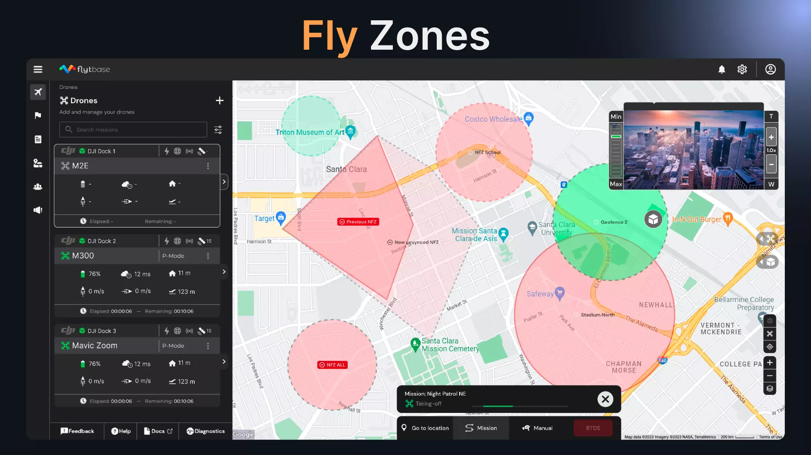

# Introducing Fly Zones, DJI AirSense, Drag to Move Gimbal, and Enhancements to Map Annotations

We are excited to announce our latest FlytBase release, marking a significant leap in ensuring safe, compliant, and more optimized remote drone operations. This update brings you three groundbreaking features: Fly Zones for precise operational control, DJI AirSense for enhanced situational awareness, and intuitive drag-to-drag-to-move gimbal functionality. Additionally, we are also introducing enhancements to our Live Map Annotations, designed to improve mapping, navigation, and team collaboration.

## Fly Zones

Gain unparalleled control over your drone's operational space with Fly Zones. Create and manage No Fly Zones and Geofences directly from your dashboard, ensuring your drones fly only where they should. This feature not only enhances safety but also ensures strict adherence to regulatory guidelines, making it ideal for sensitive or restricted areas.

<figure><figcaption>
Fly Zones
</figcaption></figure>

* Geofence and No Fly Zone Creation: Now, you can effortlessly create and import Geofences and No Fly Zones right into your dashboard. Take control and define your drone's operational boundaries with unparalleled ease and precision. It's your airspace; manage it your way.
* Device Synchronization: With just a few clicks, synchronize your defined zones with either individual devices or your entire drone fleet across your organization. This feature ensures uniform compliance and control, making your drone operations seamless and coordinated.
* Compliant Mission Execution: Your drones will now strictly adhere to Geofences and steer clear of No Fly Zones, aligning every mission with the highest safety standards and regulatory requirements. Fly with confidence, knowing your drones are operating responsibly.
* Alert System: Stay ahead of the game with real-time alerts whenever a drone approaches or breaches your designated zones. This proactive feature enables you to respond swiftly and take corrective measures, ensuring the integrity of your operations.
* Path Planning: Experience the advantage of intelligent path planning algorithms. Your drones will navigate around restricted areas, maintaining mission integrity and safety. It's not just about where your drones fly, but how they get there.
* Manual Control Features: Even in manual mode, your drones are designed to automatically halt at the boundary of No Fly Zones. This feature prevents unauthorized entry, enhancing your control over every flight.

## DJI Airsense

<figure><figcaption>
Airsense
</figcaption></figure>

Stay ahead of potential aerial hazards with DJI AirSense. Utilizing advanced ADS-B technology, this feature provides real-time alerts about nearby aircraft, significantly reducing the risk of collisions. It's a game-changer for maintaining situational awareness, especially in busy or complex airspace, ensuring safer and more responsible drone flights.

* Real-Time Traffic Monitoring: You now have a "Live Traffic" tab on your dashboard that becomes a hub of crucial air traffic information, displaying live data about nearby aircraft threats and their positions. Stay informed and proactive in maintaining safe distances.
* Proactive Collision Alerts: Stay ahead of risks with instant alerts when aircraft enter a potential collision path. These timely notifications enable you to swiftly adjust your drone's flight path, ensuring a higher level of safety and compliance in your operations. Aircraft within a radius of 2100 meters and a relative height of ± 500 meters from your drone are classified as threats and will be highlighted in red on the map, alerting you to take necessary action. In contrast, aircraft outside this zone will be shown in grey, indicating they are not currently identified as a threat. These timely notifications enable you to swiftly adjust your drone's flight path, ensuring a higher level of safety and compliance in your operations.

## Drag to Move Gimbal: Enhanced Control for Precision Tracking

Streamline your monitoring and tracking with the new Drag to Move Gimbal functionality. While we continue to support the movements achievable through double clicks, the new drag feature offers a more fluid experience. Now, effortlessly track moving objects with a simple drag of your mouse or touchpad, ideal for continuous movement scenarios like traffic monitoring or security surveillance. Choose between the precision of double clicks and the fluidity of dragging to suit your specific tracking needs.

## Map Annotations Enhancements

We are now introducing the "Face Here" functionality, a powerful feature that allows you to mark specific points on the map for your drone to automatically orient towards. This is particularly useful for focusing on critical areas or points of interest. Coupled with the M30's range finder, which displays the distance to these marked points, you gain a comprehensive view of the drone's position relative to its target. You can use the "Face Here" functionality in conjunction with the "Go-To Location" feature to significantly boost your operational efficiency and situational awareness during drone missions.

<figure><figcaption>
Annotations
</figcaption></figure>

If you have any questions or would like to share your feedback on optimizing your autonomous drone operations, don't hesitate to contact our team at [support@flytbase.com](mailto:support@flytbase.com) We're here to guide you every step of the way!
