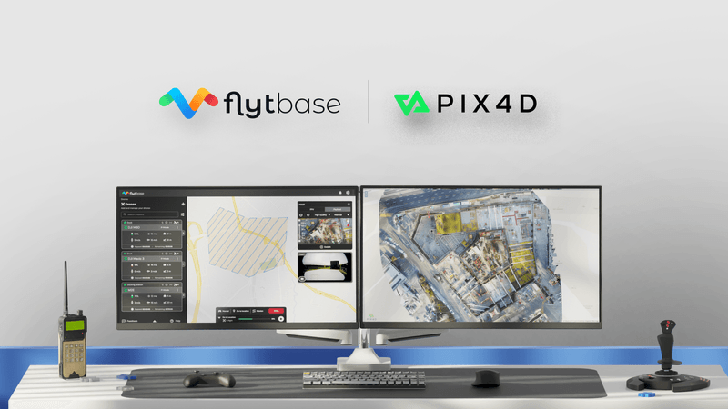

# New Features: Pix4D Flinks Integration, VVM Statistics, and Updates to Gallery

In drone mapping and surveying, creating drone data workflows, and managing large imagery volumes, while maintaining resource visibility are constant challenges. To address these, FlytBase is excited to introduce two new features: **Pix4D integration using Flinks**, and **Video Viewer Minutes (VVM) Statistics**.  In addition to these, the **Gallery** has been updated to make media management and export a seamless process. These updates streamline workflows, improve data management, and give you better control over resources.

Explore the details below to see how these features can enhance your operations:

* **New Pix4D Integration**
  * Connect Pix4D directly to FlytBase via Flinks to process drone-captured imagery for detailed 2D and 3D maps.
  * Streamline high-quality map and model creation, improving workflow efficiency for mapping and surveying professionals.

<figure><figcaption>
Pix4D Flink Integration with FlytBase
</figcaption></figure>

* #### Video Viewer Minutes (VVM) Statistics
  * Track your monthly VVM usage with detailed statistics to manage resources effectively.
  * Easily recharge VVMs as needed to ensure uninterrupted operations.

<figure><figcaption>
VVM Statistics on FlytBase
</figcaption></figure>

* #### Improved Gallery
  * View the exact location and details of every photo your drone captures, enhancing data accuracy.
  * Export and share media as zipped folders via email, or send directly to data processing Flinks, streamlining your workflow.

<figure><figcaption>
Geolocation data for images in Gallery
</figcaption></figure>

For more information, please refer to our [documentation](https://docs.flytbase.com/).
